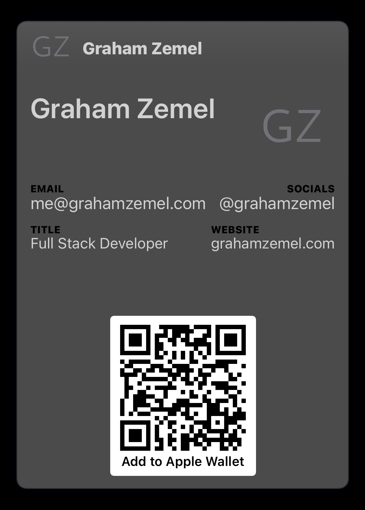

# GrahamZemel.pass

My business card as an Apple Wallet pass.

## Install

Open the following link on an device that supports Apple Wallet (iOS or macOS):

- [https://pass.grahamzemel.com](https://githubredirect.com)

📷 Alternatively, use the camera app on your device to scan the QR code:

## Making Your Own

### Pass Configuration

My pass uses the "Generic" style, which is the best fit for a business card.
There are different sets of fields and design options available for each of the
different pass types.

### Pass Signing

Once you've configured the pass and added assets, you will need to
[sign and compress](https://developer.apple.com/library/archive/documentation/UserExperience/Conceptual/PassKit_PG/YourFirst.html#//apple_ref/doc/uid/TP40012195-CH2-SW28)
the pass package. Note that you will need to
[Create a Pass Type Id & Pass Signing Certificate](https://www.skycore.com/help/creating-pass-signing-certificate/).

## 📄 License

This repo is licensed under the MIT License. See the [LICENSE](LICENSE.md) file for rights and limitations.
